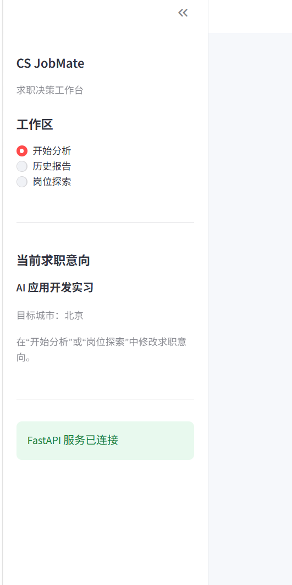
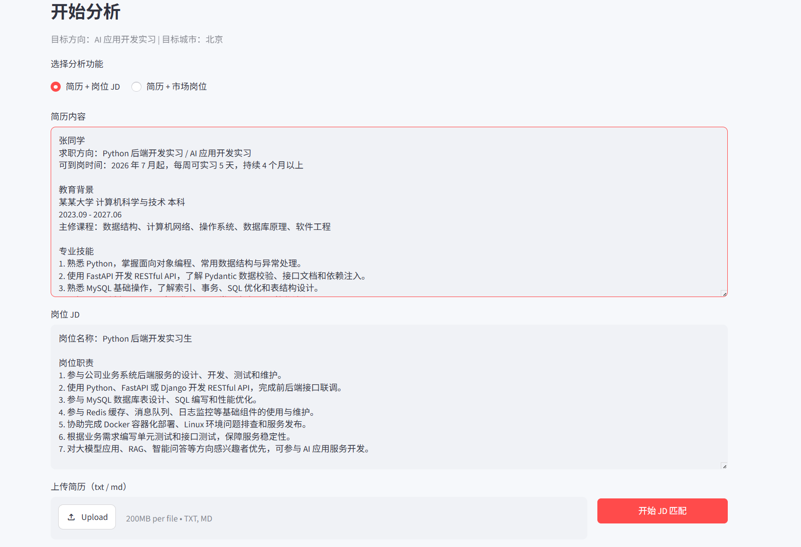
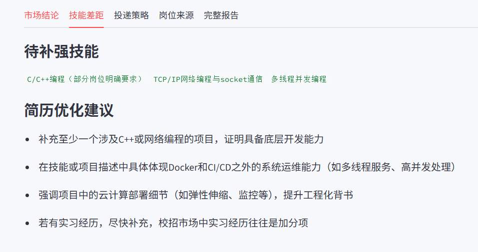
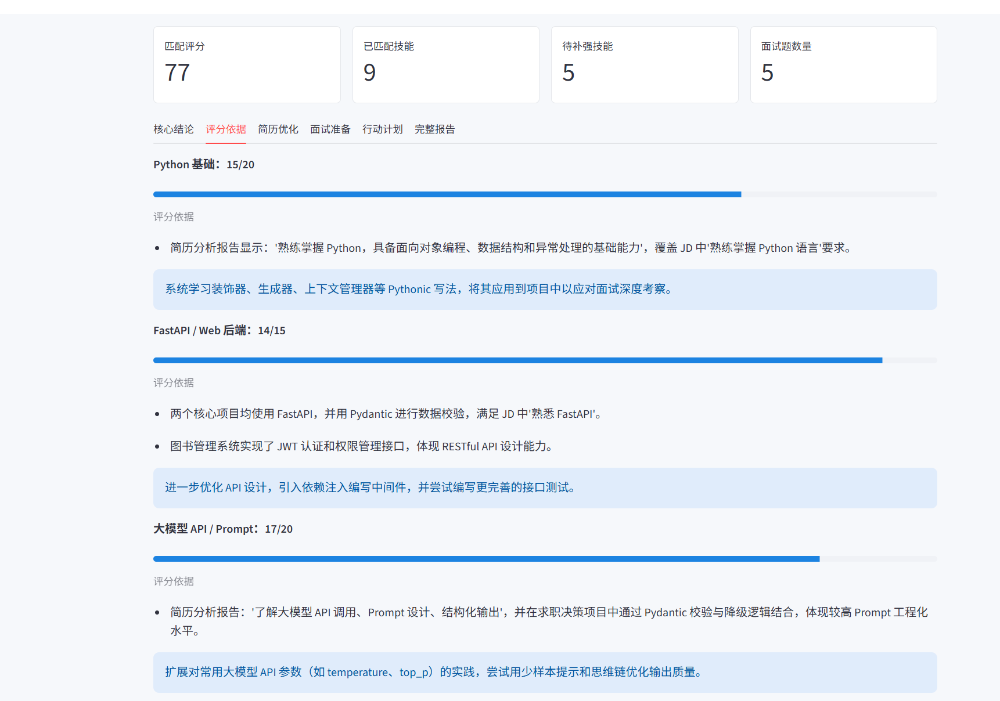
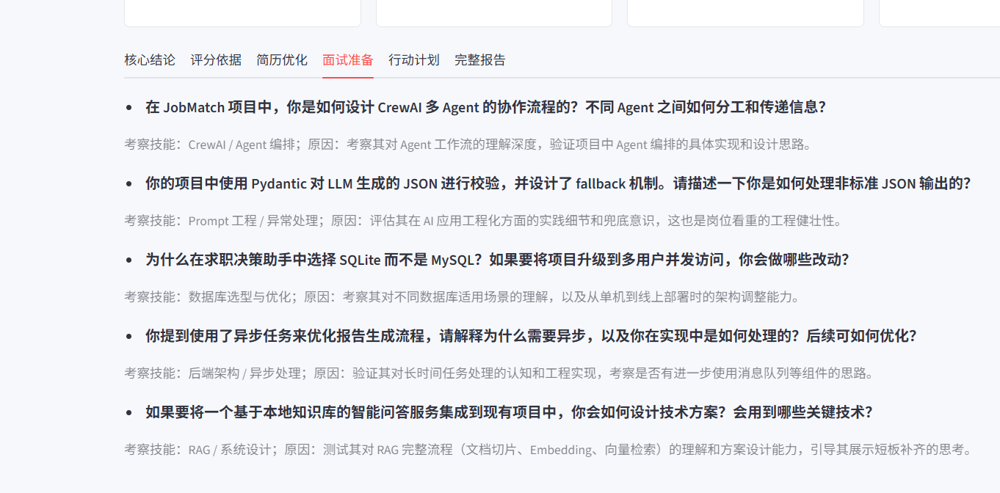

# CS JobMate (JobMatch Crew)

面向计算机专业学生的市场驱动求职决策助手。项目以 Streamlit 提供可演示工作台，使用 FastAPI、CrewAI、Pydantic 和 SQLite 构建后端能力。`CS JobMate` 是当前产品界面名称，仓库与 Python 包名保留为 `JobMatch Crew`。

## 项目定位

系统不只输出一个简历分数，而是围绕求职决策提供两类分析：

- **简历 + 岗位 JD**：分析特定岗位的匹配度、证据、技能缺口、简历修改建议、面试题和行动计划。
- **简历 + 市场岗位**：按目标方向和城市搜索岗位样本，完成岗位去重、时效判断、市场技能画像和投递建议。

核心链路：

```text
简历 / JD 输入 -> 多 Agent 分析 -> Pydantic 结构化校验
-> 规则化评分与报告渲染 -> SQLite 历史追溯
```

## 技术栈

- Python、FastAPI、Uvicorn
- CrewAI、DeepSeek / OpenAI-compatible API
- Pydantic：接口校验、LLM 输出结构化校验
- Vue 3 + TypeScript + Vite：求职副驾、简历中心、岗位收件箱和持续工作区前端
- Streamlit：市场分析与 Prompt 调试的兼容工作台
- SQLite：报告、岗位样本、异步任务和简历版本存储
- Tavily Search：岗位搜索入口
- Pytest、uv

## 已实现能力

- 统一工作台，可切换“简历 + 岗位 JD”和“简历 + 市场岗位”两种分析方式。
- CrewAI 多 Agent 协作生成岗位分析、简历分析、匹配评分和结构化报告。
- 结构化结果优先展示：匹配分、已覆盖技能、待补强技能、评分依据、简历 Bullet、面试题和行动计划。
- Pydantic 校验模型输出；解析失败时保存原始调试信息，并向用户展示受控降级报告。
- 多查询召回岗位候选，按目标方向核心技能计算相关度并过滤低相关结果，避免通用后端岗位污染市场画像。
- 对方向相关岗位进行轻量详情验证：优先解析公开页面的 `JobPosting JSON-LD`，提取公司、发布日期和截止日期；无日期但存在投递入口的岗位标记为 `likely_active`，要求用户打开原链接确认。
- 分离“趋势适配度”和“投递适配度”：趋势分可基于方向相关样本生成；投递分与 A/B/C 推荐只基于确认可投岗位。
- FastAPI `BackgroundTasks` 支持市场分析任务状态查询；SQLite 保存历史报告和岗位来源。
- 提供简历结构化解析与简历版本 API，供后续工作台接入“解析 - 确认 - 保存版本”流程。
- 证据链支持人工确认、拒绝和修正，反馈历史可脱敏导出为离线评测候选样本。
- 提供本地 `/health/ready`、运行能力查询和 SSE keepalive，便于单用户启动后检查服务状态。

## 功能演示

以下截图来自一次“Python 后端开发实习 / AI 应用开发实习”测试简历与 JD 的实际运行结果。

### 1. 工作区与求职意向

侧栏集中展示工作区入口、当前目标方向、目标城市和后端连接状态；求职意向在主工作区配置，不隐藏在侧栏表单中。



### 2. 统一输入工作台

用户选择分析模式后输入简历和目标 JD，也可以上传 `txt` 或 `md` 格式简历；提交按钮与上传入口放在同一操作区。



### 3. 结构化匹配总览

报告优先展示匹配评分、已匹配技能数量、待补强技能数量和面试题数量，再按标签页查看细节，减少用户阅读长 Markdown 的成本。



### 4. 评分依据与可解释建议

每个评分维度展示分数、评分证据和下一步建议。评分结果需要有简历或 JD 文本中的证据支撑，而不是只返回黑盒结论。



### 5. 简历优化结果

系统将模型输出整理成可审阅的简历 Bullet 建议，帮助用户针对岗位补充技术事实和项目产出。


### 6. 面试准备与行动计划

根据技能缺口生成面试问题，并输出带有预期产出的阶段性补强计划。




> 截图中的简历 Bullet、面试题和学习计划均为模型生成建议，用户必须基于真实项目经历复核后再用于简历或面试。系统不会把模型建议当作已验证事实。

## 架构与可靠性设计

- **共享 LLM 工厂**：`app/llm_factory.py` 统一创建 CrewAI 的 LLM 客户端。简历解析使用 `temperature=0`，降低信息抽取结果的不一致性；市场分析和多 Agent 匹配使用统一项目配置。
- **结构化输出优先**：模型原始文本先经 JSON 提取与 Pydantic 校验，再渲染 Markdown；失败时不直接向用户展示原始 JSON 或模型文本。
- **岗位数据质量保护**：候选岗位先经过方向相关性过滤和详情验证，再分为 `active`、`likely_active`、`unknown`、`expired`。有效岗位不足时仅展示趋势适配度，不展示看似精确的投递分或 A/B/C 推荐。
- **可追溯存储**：报告保存 `raw_result`、`parsed_result`、解析状态和岗位样本，便于排查模型输出和查看分析依据。

## 项目结构

```text
jobmatch-crew/
├── app/
│   ├── api/                 # FastAPI 路由，包括简历版本接口
│   ├── schemas/             # Pydantic 请求、响应与 LLM 输出模型
│   ├── services/            # 求职匹配、市场画像、简历解析等业务服务
│   ├── prompts/             # Agent Prompt 模板
│   ├── rag/                 # 轻量知识检索模块
│   ├── database.py          # SQLite 初始化与数据访问
│   ├── llm_factory.py       # 统一 LLM 客户端工厂
│   └── main.py              # FastAPI 应用入口
├── frontend/                # Streamlit 工作台
├── frontend-web/            # Vue 3 求职工作区
├── knowledge/               # 面试知识库资料
├── tests/                   # API、Schema、解析与规则测试
└── docs/images/             # README 运行截图
```

## 本地运行

安装依赖：

```bash
uv sync
```

在 `.env` 中配置模型与搜索服务所需的密钥后，启动后端：

```bash
uv run uvicorn app.main:app --reload
```

启动 Streamlit 前端：

```bash
uv run streamlit run frontend/streamlit_app.py
```

启动 Vue 前端：

```bash
cd frontend-web
pnpm install
pnpm dev
```

访问地址：

```text
Vue 工作区：http://localhost:5173
Streamlit 兼容工作台：http://localhost:8501
接口文档：http://127.0.0.1:8000/docs
```

## 可选 Redis 缓存

项目使用 Redis 作为可选加速层，SQLite 仍然保存简历版本、报告、证据链、人工反馈和会话历史。Redis 未启动或连接失败时，系统会自动回退到现有 SQLite + LLM 流程，不影响核心功能。

复制 `.env.example` 为 `.env` 后，可以按需启用：

```env
CACHE_ENABLED=true
REDIS_URL=redis://localhost:6379/0
CACHE_PREFIX=jm:v1
CACHE_FAIL_OPEN=true
```

当前缓存内容包括：

- JD 要求抽取、证据裁决、报告表达等已通过 Pydantic 校验的结构化阶段结果；
- 副驾报告上下文快照和相同报告下的精确重复追问回答。

缓存 Key 只使用版本、ID 和哈希，不包含简历、JD 或问题原文。上下文快照只保留报告事实、证据片段和最近少量消息，不会重复向模型发送整份简历和完整 JD。人工证据反馈会改变上下文版本，使旧缓存不能继续使用。Redis value 可能包含受控证据片段，因此 Redis 只应运行在本机或私有网络中。

## 测试

```bash
uv run pytest
python -m evals.run_evals --retrieval tfidf

cd frontend-web
pnpm test
pnpm build
pnpm lint
```

当前后端测试覆盖 API 基础可用性、Schema 校验、报告解析、岗位时效规则、岗位搜索去重、岗位 JSON-LD 验证、趋势适配度、RAG 检索、数据库时间转换、简历版本、副驾闭环和人工证据复核；当前共 `82` 条后端测试通过，Vue API 客户端有独立单测。

## 当前边界与后续方向

- 岗位搜索当前以 Tavily 为入口，搜索结果可能是招聘聚合页或摘要；投递前仍需打开原链接确认岗位有效性。
- 当前使用本地 SQLite 与 FastAPI `BackgroundTasks`，定位为单用户本机运行；不提供账号、租户隔离、可靠任务重试或公网部署能力。
- `EMBEDDING_ENABLED=false` 时默认使用 TF-IDF；Hybrid 仅作为显式配置的实验策略，失败会受控回退。
- 可通过 `python -m evals.export_reviewed_feedback --database jobmatch.db` 导出人工修正/拒绝的脱敏评测候选数据，不会覆盖现有 fixtures。
- 启动后可运行 `powershell -ExecutionPolicy Bypass -File scripts/smoke.ps1` 检查健康状态和非敏感能力信息。
- Vue 已覆盖副驾、简历版本、岗位收件箱、成长计划和投递管道；Streamlit 保留为兼容和调试入口。
- 下一阶段优先完成：岗位详情的面试复盘、简历区块差异确认、投递事件时间线，以及账号和隐私隔离。
